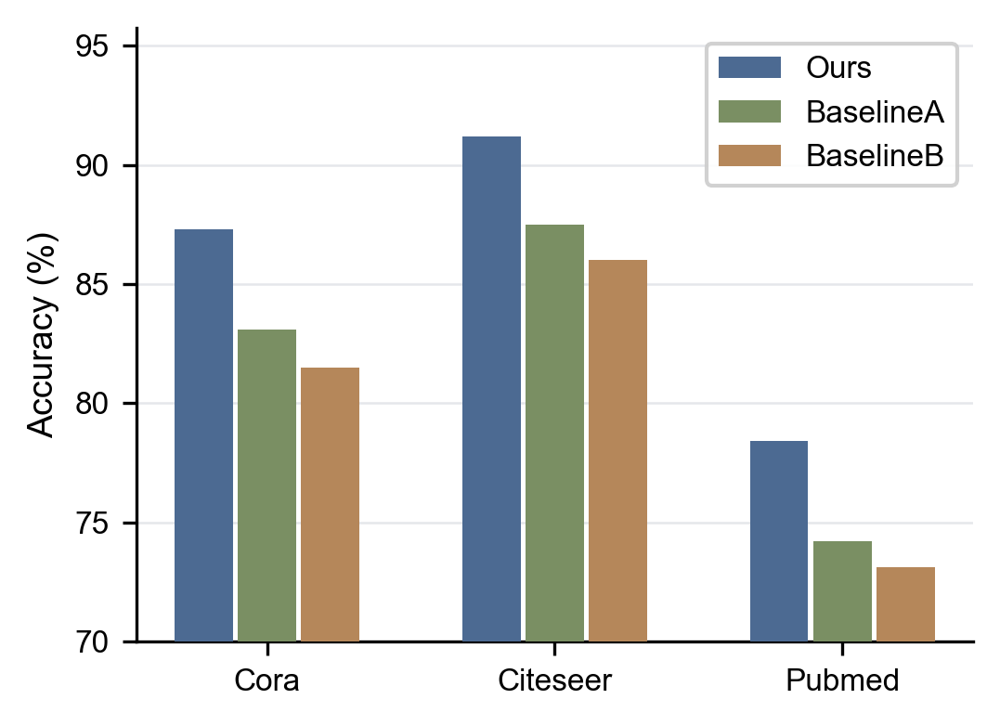
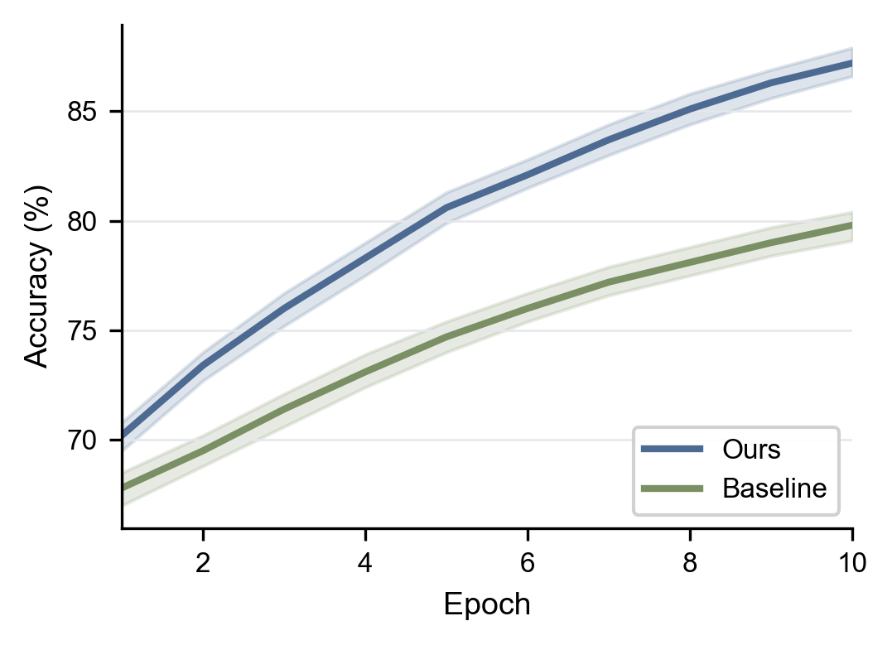

# figure-plot

[English](./README.md) | [中文](./README_ZH.md)

`figure-plot` 是一个面向 AI/ML 科研实验结果的轻量绘图 Skill，用于把实验数据转成发表级静态图表。

它适合这三类输入：

- `.csv`、`.xlsx`、`.json` 结果文件
- 粘贴的 Markdown 表格或 CSV 文本
- 用自然语言描述的实验对比结果

Skill 的目标不是“随便画一张图”，而是引导 Agent 完成一条更稳的论文出图链路：

1. 先检查依赖
2. 先读数据、确认结构
3. 选择正确图类
4. 生成一小段可运行的绘图脚本
5. 同时导出 `PDF` 和 `PNG`
6. 检查渲染后的图，再做必要微调

这个项目默认面向学术论文图，不面向 dashboard 或交互式可视化。

## 当前支持的图类

当前版本覆盖了六类最常见的科研图：

- `comparison-bar`
- `ablation-bar`
- `training-curve`
- `hyperparam-heatmap`
- `box-runs`
- `scatter-tradeoff`

默认风格偏论文投稿：

- `matplotlib` + `seaborn`
- 白底
- 克制配色
- 向量友好导出
- 默认开启 `pdf.fonttype = 42` 和 `ps.fonttype = 42`

## 仓库结构

```text
figure-plot/
├── SKILL.md
├── README.md
├── README_ZH.md
├── LICENSE
├── Makefile
├── .gitignore
├── agents/
│   └── openai.yaml
├── examples/
│   ├── comparison_results.csv
│   ├── generate_comparison_bar.py
│   ├── training_curve_results.csv
│   ├── generate_training_curve.py
│   ├── ablation_results.csv
│   ├── generate_ablation_bar.py
│   ├── heatmap_results.csv
│   ├── generate_hyperparam_heatmap.py
│   └── output/
│       ├── comparison_bar_example.png
│       └── comparison_bar_example.pdf
├── references/
│   ├── plot-presets.md
│   ├── style-guide.md
│   ├── data-patterns.md
│   └── troubleshooting.md
├── scripts/
│   ├── install-skill.sh
│   ├── check-deps.sh
│   ├── self-test.sh
│   └── release-test.sh
└── .github/workflows/
    └── ci.yml
```

## 核心文件

- [SKILL.md](./SKILL.md)：Skill 触发条件、工作流、图类选择逻辑、样式约束和自查清单
- [references/plot-presets.md](./references/plot-presets.md)：各图类默认参数和代码骨架
- [references/style-guide.md](./references/style-guide.md)：学术绘图 rc 参数、配色和版面尺寸建议
- [references/data-patterns.md](./references/data-patterns.md)：常见 pandas reshape / 聚合模式
- [references/troubleshooting.md](./references/troubleshooting.md)：常见 matplotlib / seaborn 问题和修复方法
- [agents/openai.yaml](./agents/openai.yaml)：Skill UI 元数据
- [examples/comparison_results.csv](./examples/comparison_results.csv)：真实示例输入数据
- [examples/generate_comparison_bar.py](./examples/generate_comparison_bar.py)：可运行的示例绘图脚本
- [examples/training_curve_results.csv](./examples/training_curve_results.csv)：带置信区间的训练曲线示例数据
- [examples/ablation_results.csv](./examples/ablation_results.csv)：消融实验示例数据
- [examples/heatmap_results.csv](./examples/heatmap_results.csv)：超参数热力图示例数据
- [scripts/install-skill.sh](./scripts/install-skill.sh)：一键安装到 `~/.claude/skills`

## 快速开始

### 1. 检查依赖

```bash
./scripts/check-deps.sh
```

必需依赖：

- `matplotlib`
- `seaborn`
- `pandas`
- `numpy`

推荐依赖：

- `scipy`
- `openpyxl`

### 2. 跑快速自测

```bash
make test
```

### 3. 跑完整回归测试

```bash
make test-release
```

### 4. 生成示例图

```bash
make example
```

默认会生成 comparison bar 和 training curve 两类示例：

- `examples/output/comparison_bar_example.pdf`
- `examples/output/comparison_bar_example.png`
- `examples/output/training_curve_example.pdf`
- `examples/output/training_curve_example.png`

如果要一次生成全部示例：

```bash
make example-all
```

还会额外生成：

- `examples/output/ablation_bar_example.pdf`
- `examples/output/ablation_bar_example.png`
- `examples/output/hyperparam_heatmap_example.pdf`
- `examples/output/hyperparam_heatmap_example.png`

## 一键安装到 `~/.claude/skills`

默认安装到 Claude 的技能目录：

```bash
./scripts/install-skill.sh
```

安装到指定路径：

```bash
./scripts/install-skill.sh /path/to/skills
```

或者：

```bash
CLAUDE_SKILLS_HOME=/path/to/skills ./scripts/install-skill.sh
```

## 示例输出

仓库里已经提交了两类可直接预览的示例输出：

| Comparison Bar | Training Curve |
| --- | --- |
|  |  |

另外也包含：

- `examples/output/ablation_bar_example.png`
- `examples/output/hyperparam_heatmap_example.png`

## 典型触发请求

下面这些请求都应该触发这个 Skill：

- “把这个消融实验表画成论文风格柱状图”
- “把这个 CSV 转成 NeurIPS 风格的对比图”
- “根据这些结果画训练曲线，并带误差带”
- “画一个超参数敏感性热力图”
- “把这张结果表做成 camera-ready figure”

## 使用约束

推荐工作流是：

1. 先检查输入数据
2. 如果图类不明确，先问一个澄清问题
3. 选择最简单、最能表达 claim 的图类
4. 用显式绘图代码，不依赖隐式默认值
5. 同时导出 `pdf` 和 `png`
6. 检查 `png` 渲染结果后再报告完成

这个项目默认避免：

- 交互式绘图库
- 装饰性 dashboard 风格
- 过亮、过花的配色
- 从模糊描述里直接猜图类

## 说明

- 测试脚本默认使用 headless-safe 的 Matplotlib 后端，因此可以在 macOS 或无 GUI 环境里稳定跑通。
- 脚本会隔离 Matplotlib 缓存目录，避免自动化测试时出现缓存目录不可写问题。
- 当前仓库重点是 Skill 主体、参考文档和验证脚本；已经补齐了 README、License、UI 元数据和基础 CI。

## 开发命令

```bash
git status
make test
make test-release
make example
make example-all
./scripts/install-skill.sh
```

如果修改了图类默认值、导出规则或脚本，至少重新跑两套测试再提交。

## GitHub 配置

仓库里已经补了：

- [release 配置](./.github/release.yml)：按 tag 生成 GitHub Release
- [labels 配置](./.github/labels.yml)：统一管理项目标签
- [labels 同步工作流](./.github/workflows/labels.yml)：把配置同步到仓库标签
